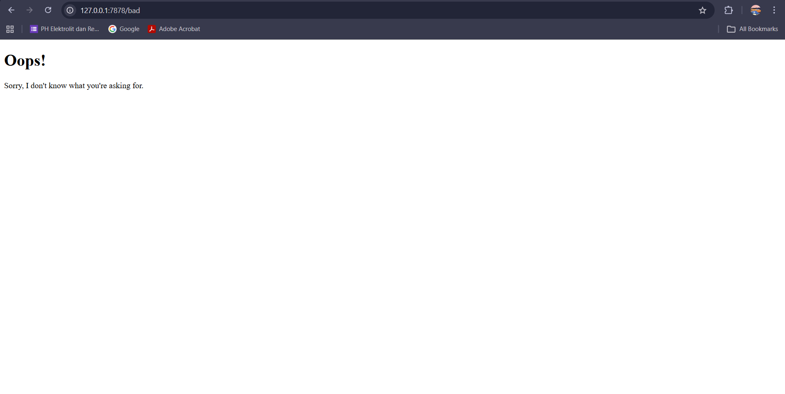

# Tutorial 6 - Concurrency

## Commit 1 Reflection notes

Pada *commit* ini, saya mengimplementasikan *single-threaded web server* sederhana menggunakan bahasa Rust yang mendengarkan koneksi TCP pada *port* 7878. Fungsi `handle_connection` ditambahkan untuk menerima dan memproses setiap *stream* koneksi yang masuk dari klien (seperti *browser*). Di dalam fungsi tersebut, saya menggunakan `BufReader` yang membungkus *stream* agar data dapat dibaca secara efisien baris demi baris. Program diinstruksikan untuk membaca baris-baris teks tersebut secara iteratif hingga menemukan baris kosong, yang menandakan akhir dari bagian *header* sebuah HTTP *request*. Hasil pembacaan ini kemudian dikumpulkan dan dicetak ke terminal. Dari proses ini, saya dapat melihat wujud mentah dari HTTP *request* yang dikirimkan oleh *browser*, seperti metode yang digunakan (`GET`), rute yang diminta (`/`), serta versi protokolnya (`HTTP/1.1`), yang memberikan pemahaman fundamental tentang bagaimana komunikasi web bekerja di tingkat dasar.

## Commit 2 Reflection notes

Pada *commit* ini, saya telah berhasil memodifikasi fungsi 1handle_connection1 sehingga server tidak hanya menerima koneksi, tetapi juga mampu memberikan respons balik berupa halaman HTML. Saya menambahkan penggunaan library `std::fs` untuk membaca konten dari file `hello.html` secara langsung menggunakan fungsi `fs::read_to_string`. Penentuan baris status respons ditetapkan pada `"HTTP/1.1 200 OK"` untuk menginformasikan kepada browser bahwa permintaan berhasil diproses.

Selain itu, saya menghitung panjang konten file tersebut agar dapat dimasukkan ke dalam header `Content-Length`, yang sangat *krusial* agar browser mengetahui jumlah data byte yang harus dibaca. Seluruh komponen respons, mulai dari baris status, header, hingga isi konten, digabungkan menggunakan makro `format!` dengan pemisah baris `\r\n` sesuai dengan standar protokol HTTP. Terakhir, data tersebut dikirimkan kembali ke klien melalui metode `stream.write_all` yang mengubah string respons menjadi *deretan byte* agar bisa ditransmisikan melalui jaringan.

## Commit 3 Reflection notes

Pada *commit* ini, saya menambahkan fitur validasi rute untuk memberikan respons yang berbeda berdasarkan *endpoint* yang diakses oleh klien. Saya mengambil baris pertama dari HTTP *request* untuk mengecek apakah rute yang diminta adalah `"GET / HTTP/1.1"`. Jika benar, server akan mengembalikan file `hello.html` dengan status `200 OK`. Namun, jika rute tidak dikenali (seperti `/bad`), server akan menangkapnya pada blok `else` dan mengembalikan file `404.html` dengan status `404 NOT FOUND`. 

Selain itu, saya juga melakukan *refactoring* dengan memisahkan blok kondisional (`if-else`) dari proses pembacaan file dan penulisan respons ke `stream`. *Refactoring* ini sangat penting karena berhasil menghilangkan duplikasi kode pembacaan file yang sebelumnya ada di setiap cabang pengkondisian. Hasilnya, struktur program menjadi jauh lebih rapi, efisien, dan terpusat, sehingga lebih mudah dipelihara di masa depan.

## Commit 4 Reflection notes

Pada tahap ini, saya menambahkan rute `/sleep` yang disimulasikan sebagai proses berat menggunakan `thread::sleep` selama 10 detik. Ketika saya mengakses rute `/sleep` di satu tab *browser*, dan kemudian segera mengakses rute normal `/` di tab lain, tab kedua tersebut ikut tertahan (*loading*) dan baru menampilkan hasilnya setelah rute `/sleep` selesai diproses. Fenomena ini membuktikan bahwa arsitektur *single-threaded* memproses setiap permintaan secara sekuensial (antrean). Jika ada satu *request* yang memakan waktu sangat lama, *thread* utama akan terblokir sehingga *request* lain yang menyusul harus menunggu antrean, yang mana sangat tidak efisien dan berbahaya untuk performa web server di dunia nyata.